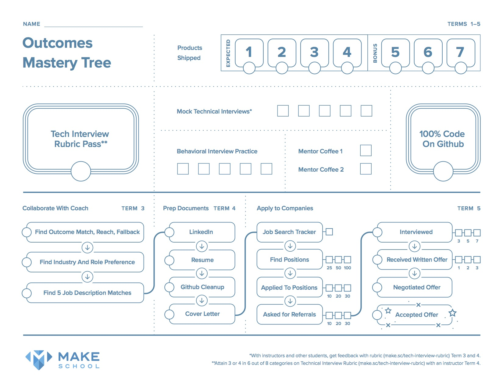

Congrats!

You've made it to term 3 of Make School. Since September, you've shipped new products, learned new languages, and stretched yourself beyond what you thought possible.

Now it is time to think about your summer.

Over the next terms we'll help you become a stellar job applicant.

I'll begin by scoping out our work together for the coming months. This will give you a high level view of the job search process. It may seems like a lot to manage, don't worry. We'll cover each components together over the coming months.

## Our work path
Take a look at this *Outcomes Mastery Tree*.

The **Outcomes Mastery Tree** offer's a snap shot of everything you need to do to get a job. It may seem overwhelming at first, but have no fear. Our core classes, outcomes workshops, and coaching sessions will ensure that you complete everything on time and in the right order.  Along the way, you can use the Outcomes Mastery Tree to check off tasks as you complete them. #gameification!

The Mastery Tree also **charts the order in which to complete the steps**. It is crucial that you accomplish everything in this order since the content builds on itself.

Let's walk through it. (watch the video or read a summary below)

## Top Row: Shipped products
The top row of the Mastery Tree is your **portfolio**. Your Github and shipped products are the foundational content that recruiters will use to assess your talents as an engineer. These, more than anything else, demonstrates your ability to build high quality products.

Before applying to jobs, you should have ~3-4 projects shipped that you are proud of. Luckily we've been working on this all year! If you are behind, talk to your coach.

## Top Half: Ongoing Interview Preparation
We've structured interview preparation into the Make School calendar. These are represented in the items in the top half of the Outcomes Mastery Tree:
* **Mock Technical Interviews** - we'll practice technical interviews every week in core.
* **Tech Interview Rubric Pass** - Captain rainbow and a google engineer designed this technical interview rubric. You'll keep practicing technical interviews until you attain a 3 or 4 in 6 out of 8 categories. Everybody will put in dozens of hours of practice over the coming months. So if you start off with a low score, have no fear. Time to level up.
* **Behavioral Interviews** - we'll practice these in outcomes workshops and a few core classes
* **Mentor Coffees** - these are an opportunity to meet up with engineers at a company of interest. You can also ask about their work environment to gain insight into what companies would be a good fit for you.
* **100% of code in Github** - this allows recruiters to see the code quality of your projects.

## Bottom Half:

### Term 3: coaching

In term 3 you'll work one on one with your coach to and introspect on what jobs might be a good fit for you? What industries interest you? What are your "must have's" for roles?

### Term 4: Two Day Bootcamp: Resume, LinkedIn, Interview
We'll start term 4 with a two day Outcomes Bootcamp. You'll leave these days with an A+ resume, LinkedIn, and to tell your career story in a provocative, engaging way.

### Term 5: Two Day Bootcamp: Cover Letter, Application
Term 5 will begin with a two day workshop on cover letters, finding companies, and applying. We'll also show how to get warm introductions to people in companies. You'll spend the rest of the term applying to companies.

## Life Long Skills

These tutorial teach you more than finding a job. It's about advocating for yourself - articulating the value you have to offer and why your accomplishments demonstrate your talents as an engineers. The skills you'll develop through this tutorial will serve you for the rest of your life. You'll learn not just how to find a job, but how to navigate your career.

# Where do we go from here?

Before we jump in, let's take a diagnostic on our current skills sets. This will help you understand which companies and roles match your current skills.

Specifically, we'll evaluate our current level of job readiness and company fit.
